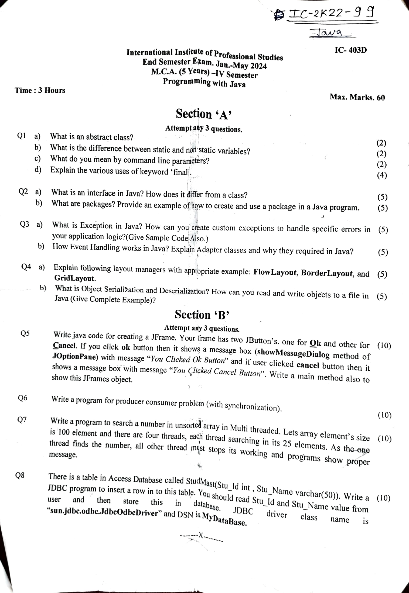

# 📘 4th_End_Sem Preparation

[📄 2k24 End Sem](2k24_End_Sem.pdf)

## 📚 Subjects

- [JAVA](#java)
- [Discrete Mathematics](#discrete-mathematics)
- [DCC](#dcc)
- [Entrepreneurship](#entrepreneurship)
- [Unix OS](#unix-os)

---

## JAVA



---

### Q1 (a) What is an abstract class?

An **abstract class** in object-oriented programming is a class that **cannot be instantiated directly**—it serves as a **blueprint for other classes**.

- It may contain **abstract methods** (no body) and **fully implemented methods**.
- Used to define a **base class** with some functionality and enforce implementation of key behavior in subclasses.

```java
abstract class Animal {
    abstract void makeSound();  // abstract method
    void sleep() {
        System.out.println("Sleeping...");
    }
}
```

---

### Q1 (b) What is the difference between static and non-static variables?

| Feature             | Static Variable                            | Non-static Variable                       |
|---------------------|---------------------------------------------|-------------------------------------------|
| Belongs to          | The **class**, not an instance              | A **specific instance** (object)          |
| Memory allocation   | Once, at the time of class loading          | Every time a new object is created        |
| Accessed by         | Class name or object                        | Only by object                            |
| Shared by           | All instances of the class                  | Unique for each object                    |

```java
class Counter {
    static int count = 0;
    int id;

    Counter() {
        count++;
        id = count;
    }
}
```

---

### Q1 (c) What do you mean by command line parameters?

**Command line parameters** are values passed to the `main()` method of a Java program during execution via terminal.

```java
public class Hello {
    public static void main(String[] args) {
        System.out.println("Hello, " + args[0]);
    }
}
```

Example command:
```bash
java Hello Alice
```

Output:
```
Hello, Alice
```

---

### Q1 (d) Explain the various uses of keyword `final`

The `final` keyword is used in Java to restrict the user.

#### i) Final variable
Value **cannot be changed** once assigned.

```java
final int x = 10;
// x = 20; // Error!
```

#### ii) Final method
**Cannot be overridden** by subclasses.

```java
class A {
    final void show() {
        System.out.println("Final method");
    }
}
```

#### iii) Final class
**Cannot be extended** (no inheritance).

```java
final class MyClass { }
// class SubClass extends MyClass {} // Error!
```

---

### Q2 (a) What is an interface in Java? How does it differ from a class?

An **interface** defines a set of abstract methods (by default) that a class must implement.

```java
interface Animal {
    void eat();
    void sleep();
}
```

```java
class Dog implements Animal {
    public void eat() {
        System.out.println("Dog eats.");
    }
    public void sleep() {
        System.out.println("Dog sleeps.");
    }
}
```

Interfaces can also have:
- Constants (implicitly `public static final`)
- `default` and `static` methods (Java 8+)

#### Differences Between Interface and Class

1. **Methods**: Class can have implemented methods; interface methods are abstract by default.
2. **Instantiation**: Classes can be instantiated; interfaces cannot.
3. **Inheritance**: A class can implement multiple interfaces, but extend only one class.
4. **Constructors**: Classes can have constructors; interfaces can't.
5. **Field Behavior**: Interface fields are always `public static final`.

> Use a class for defining structure and behavior.  
> Use an interface for defining rules or capabilities.

---

### Q2 (b) What are Packages?

A **package** is a namespace that organizes related classes and interfaces.

#### Benefits:
- Better organization
- Avoid naming conflicts
- Access control
- Easier to locate and reuse classes

#### How to Create and Use a Package

##### Step 1: Create a Package

```java
package mypack;

public class Message {
    public void show() {
        System.out.println("Hello from mypack!");
    }
}
```

📁 Save this in a folder named `mypack`.

##### Step 2: Use the Package

```java
import mypack.Message;

public class Test {
    public static void main(String[] args) {
        Message msg = new Message();
        msg.show();
    }
}
```

##### Step 3: Compile and Run

```bash
javac -d . mypack/Message.java
javac Test.java
java Test
```

> `-d .` creates the package folder structure.

---

### Q3 (a) What is an Exception in Java? How can you create custom exceptions?

An **exception** is an abnormal condition that disrupts program execution.

Java provides:
- `try`, `catch`, `finally`
- `throw`, `throws`

#### Creating a Custom Exception

##### Step 1: Define the custom exception

```java
class InvalidAgeException extends Exception {
    public InvalidAgeException(String message) {
        super(message);
    }
}
```

##### Step 2: Use it in your application

```java
public class VoterRegistration {
    public static void checkAge(int age) throws InvalidAgeException {
        if (age < 18) {
            throw new InvalidAgeException("Age must be 18 or older to register.");
        } else {
            System.out.println("You are eligible to register to vote.");
        }
    }

    public static void main(String[] args) {
        try {
            checkAge(16);
        } catch (InvalidAgeException e) {
            System.out.println("Exception Caught: " + e.getMessage());
        }
    }
}
```

**Output**:
```
Exception Caught: Age must be 18 or older to register.
```

---

## Discrete Mathematics
*Coming soon...*

---

## DCC
*Coming soon...*

---

## Entrepreneurship
*Coming soon...*

---

## Unix OS
*Coming soon...*

---
